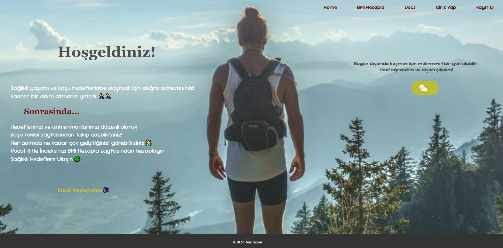

# Koşu Takibi Uygulaması

## Proje Hakkında
Bu uygulama, Python kursu kapsamında geliştirilen bir projedir. Kullanıcıların koşu performanslarını takip edebildiği, hava durumu bilgilerine ulaşabildiği ve kişisel motivasyonlarını artıracak öneriler alabildiği bir web uygulaması olarak tasarlanmıştır.

#### Uygulama aşağıdaki özellikleri sunar:

 - Güncel hava durumu bilgisi ve koşu önerileri.
 - Vücut Kitle İndeksi (BMI) hesaplama.
 - Koşu performansının kaydedilmesi ve analizi.
 - Kullanıcıya motivasyon cümleleri sunma.

 #### Özellikler

1. Hava Durumu
 - Kullanıcının seçtiği şehir için güncel sıcaklık ve hava durumu bilgisi.
 - Hava koşullarına uygun koşu önerileri.
 - Şehir adını küçük harflerle girseniz bile otomatik olarak düzeltilir.
 2. BMI Hesaplama
 - Kullanıcının boy ve kilosuna göre BMI değerini hesaplar.
 - BMI değerine göre sağlıklı kilo durumu hakkında bilgi verir.
3. Koşu Takibi
- Koşu mesafesi, süresi ve yakılan kalori bilgilerini kaydetme.
- Ortalama hız, toplam mesafe ve en hızlı koşu gibi analizler sunar.
 - Kullanıcıyı motive edecek rastgele motivasyon cümleleri sunar.
4. Performans Özeti
 - Toplam koşulan mesafe, süre ve yakılan kalori.
 - En uzun mesafeli koşunun bilgileri.
 - Ortalama hız ve son koşu performanslarının analizi.

## Teknolojiler
 - Backend: Python (veri işleme, analiz ve otomasyon), Flask
 - Frontend: HTML, CSS
 - API: OpenWeatherMap

## Kurulum ve Çalıştırma
 ### Gerekli Araçlar:
 - Python 3.x
 - Flask ve diğer Python kütüphaneleri (aşağıdaki adımlarda belirtilmiştir).
 - API anahtarı (OpenWeatherMap gibi bir hava durumu servisi için).

 ### Adımlar:
1 -Projeyi klonlayın veya indirin:

      git clone <proje-linki>
      cd <proje-dizini>
2 - Gerekli Python kütüphanelerini yükleyin:
   
      pip install -r requirements.txt

3 - .env dosyasını oluşturun ve API anahtarını ekleyin:

      API_KEY=your_openweathermap_api_key

4 - Uygulamayı çalıştırın:

      python app.py

5 - Tarayıcınızda uygulamayı açın:

      http://127.0.0.1:5000

## Kullanım

1 - Ana Sayfa:
Şehir adını yazarak hava durumu bilgisine erişin ve koşu önerilerini görün.  
2 - BMI Hesaplama:
Boy ve kilonuzu girerek BMI değerinizi öğrenin. 
3 - Koşu Takibi:
Koşu bilgilerinizi kaydedin, performans analizlerinizi inceleyin ve motivasyon cümleleriyle harekete geçin. 
4 - Performans Özeti:
Toplam mesafe, süre, kalori ve en hızlı koşu gibi detaylara erişin.

### Home Page

###  Happy Coding! ✨✨

